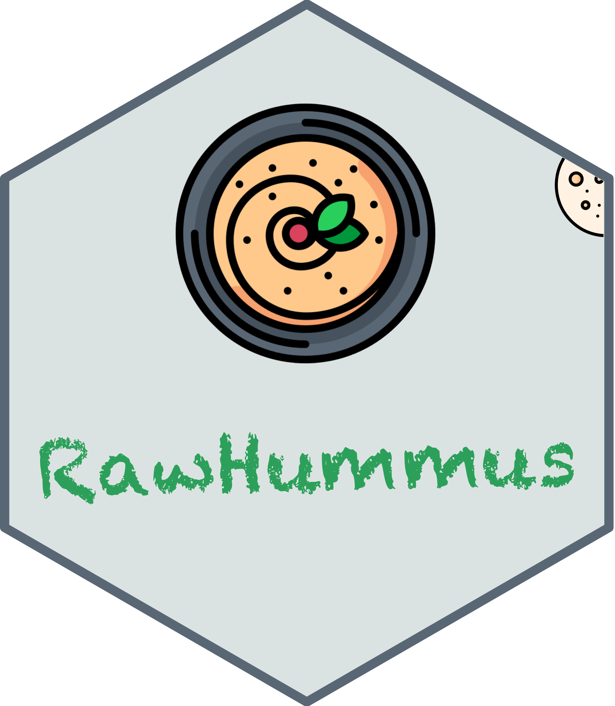

# Contact &nbsp;

------

### Report bugs:

To report bugs and/or request features, please use the following GitHub issue channel: 

[<b>https://github.com/YonghuiDong/RawHummus/issues</b>](https://github.com/YonghuiDong/RawHummus/issues)

------

### Citation

If you find **RawHummus** useful, please consider citing our publication:

RawHummus: an R Shiny App for Automated Raw Data Quality Control in Metabolomics

------

