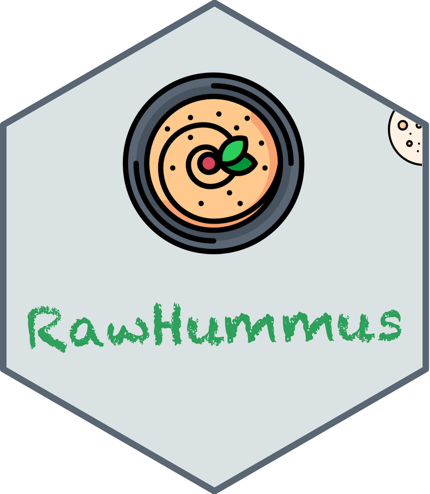

# Welcome to RawHummus &nbsp;

<b>RawHummus</b> is a quality control (QC) tool, which provides users a flexible and efficient way to evaluate their LC-MS system.

In particular, it allows to: 

(1). Visualize instrument log files, enabling users to interactively view, inspect and compare more than 30 different instrument metrics (currently only Thermo Orbitrap is supported).

(2). Evaluate LC-MS performance using Quality Control (QC) samples.

---

# Workflow

The use of RawHummus is simple. You can follow the user guide in each tab to perform your analysis.

It is worth noting that RawHummus uses the generic file formats, i.e., mzML and mzXML, for QC sample evaluation. Raw files therefore need to be converted before analysis. There are a number of means to convert instrument vendor-specific raw data formats. You can refer to [this page](https://ccms-ucsd.github.io/GNPSDocumentation/fileconversion/) for more information.

Additionally, RawHummus provides an option to convert raw files using [MSConvert software](http://proteowizard.sourceforge.net/tools.shtml), with some specific system requirements. You can refer to the user guide in **MSConvert** tab for details.

---

# About RawHummus

RawHummus is publicly available on [CRAN repository](https://cran.r-project.org/web/packages/RawHummus/index.html), with source code available on [GitHub](https://github.com/YonghuiDong/RawHummus) under a GPL-3 license. 

The web application can be installed in R/RStudio using a simple command `install.packages("RawHummus")`, and run locally with the command `runGui()`. Alternatively, the web application can be freely accessed for direct online use at [https://bcdd.shinyapps.io/RawHummus](https://bcdd.shinyapps.io/RawHMMUS/). 

---

