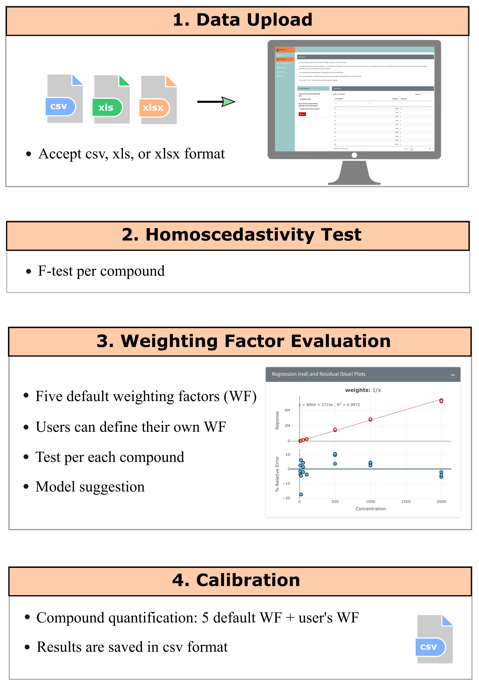
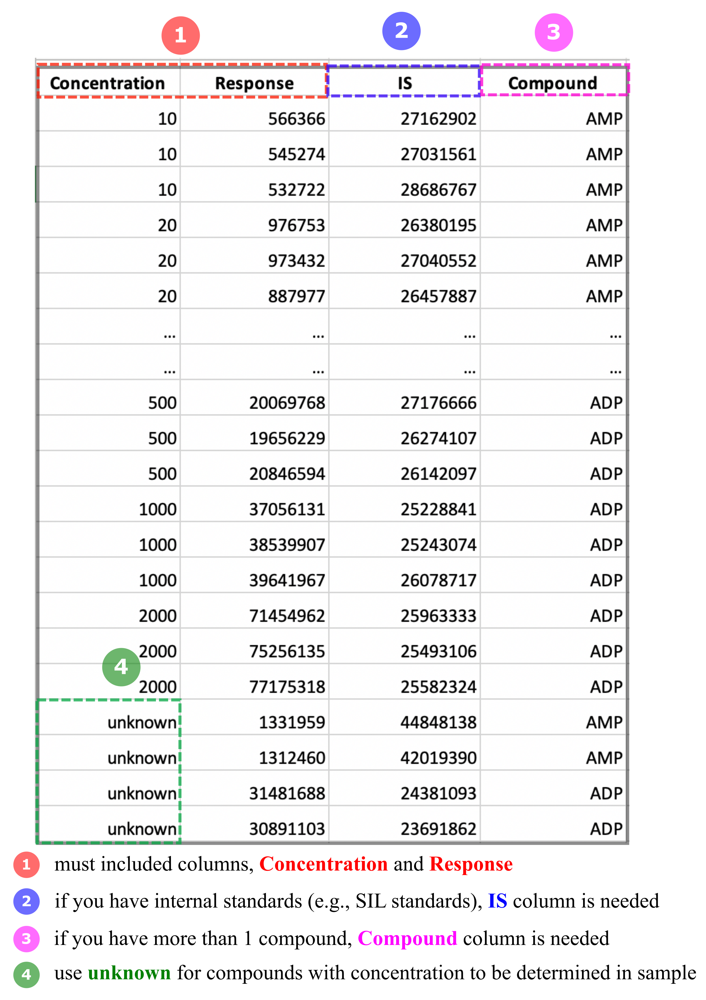

# Welcome to CCWeights &nbsp;

Calibration curves are used to understand the instrumental response to an analyte and predict the concentration in an unknown sample. A well-established and interpreted calibration curve is essential for any analytical methodology. 

<b>CCweights</b> is a web-based tool (also an R package), which provides automated and efficient data analysis workflow to evaluate and select the best weighting factor for linear calibration curve and quantify targeted analytes accordingly. 

CCWeights can be applied for any analytical assays, in which linear calibration curves are used for quantification. For instance, Ultraviolet-visible spectroscopy- and liquid/gas chromatography mass spectrometry-based quantitative studies.

---

# Workflow

Below is an overview of CCWeights workflow:

<em>Figure 1. Schematic workflow of CCWeights</em>

**Data Preparation:** 

- Data must contain at least two columns, one is `Concentration`, and another one is `Response`. In case you have more than one compound in your sample, you need to have a third column called `Compound`. If internal standards are used (e.g., stable isotope labeled internal standards), please include another column named `IS`, with the corresponding response value filled in the cell. 

- Use `unknown` for compounds with `Concentrations` to be determined in samples.

- Data with known `Concentration` will be regarded as calibration standards for calibration curve construction and evaluation.

- Data with `unknown` concentration will be regarded as unknown samples, and the `Concentration` will be predicted.
  
- You can refer to the example data in the **Upload Data** tab or **Figure 2** for the data format.
  
- You can also **[<b>download the templates here</b>](https://github.com/YonghuiDong/CCWeights/tree/main/inst/shiny/Templete)** to prepare your data accordingly.

<em>Figure 2. Data format requirement</em>

- Once data file is successfully uploaded, you can perform data analysis following the steps shown in Figure 1.

---

# About CCWeights

CCWeights is publicly available on **[<b>CRAN repository</b>](https://cran.r-project.org/web/packages/CCWeights/index.html)**, with source code available on **[<b>GitHub</b>](https://github.com/YonghuiDong/CCWeights)** under a GPL-3 license. The web application can be run locally from R console using a simple command `runGui()`. Alternatively, the web application can be freely accessed for direct online use at **[<b>https://bcdd.shinyapps.io/CCWeights/</b>](https://bcdd.shinyapps.io/CCWeights/)**. 

---

